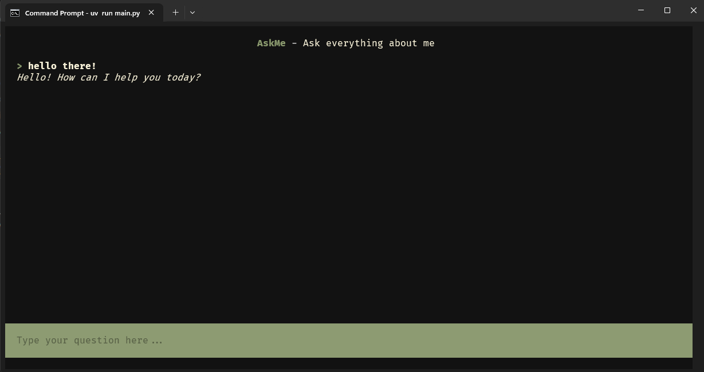

# AskMe

A terminal-based FAQ chatbot built with Python, LangChain, and Textual.



## Features

- Interactive terminal user interface powered by Textual
- AI-powered responses using LangChain and OpenAI
- Dark/light mode toggle
- Clean and responsive chat interface

## Requirements

- Python 3.12+
- OpenRouter API key

## Installation

1. Clone the repository
2. Install dependencies using uv:
   ```bash
   uv install
   ```

## Configuration

Create a `.env` file in the root directory with your OpenAI API key:
```
OPENROUTER_API_KEY=your_api_key_here
```

## Usage

Run the application:
```bash
python main.py
# or
uv run main.py
```

### Keyboard Shortcuts

- `d` - Toggle dark/light mode
- `q` - Quit the application

## Dependencies

- langchain - LLM framework
- textual - Terminal UI framework
- python-dotenv - Environment variable management
- langchain-openai - OpenAI integration for LangChain
